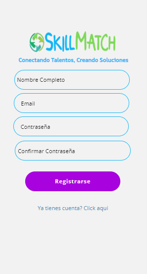
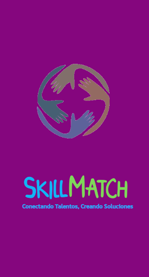
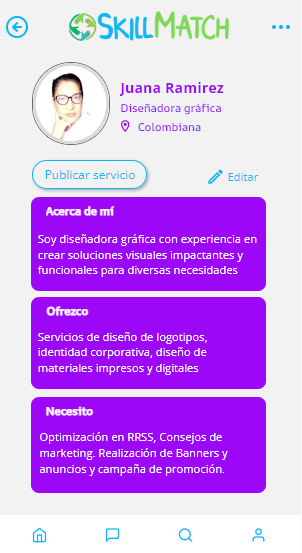
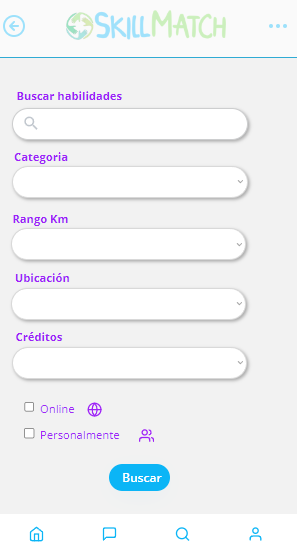
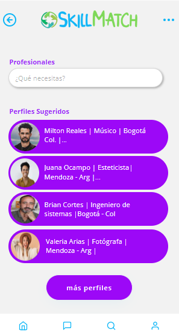
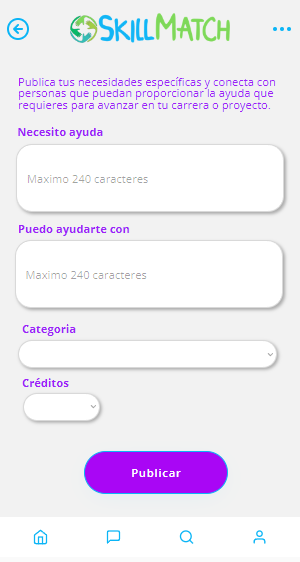
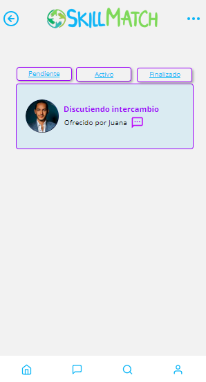
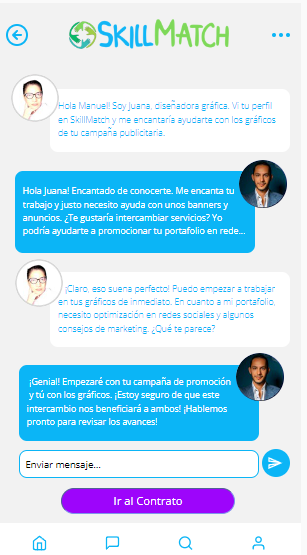
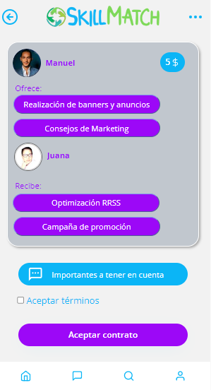
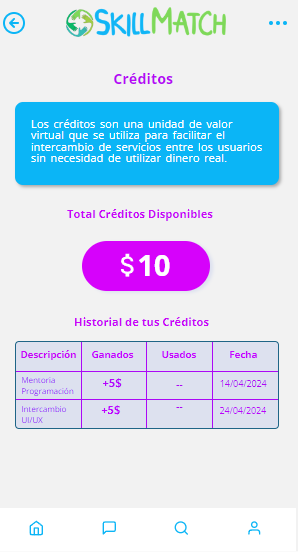

# ⚫ Skill Math  🚀 💚

Skill Match es una innovadora plataforma que permite a las personas intercambiar servicios basados en sus habilidades, eliminando la necesidad de transacciones monetarias. En lugar de dinero, utilizamos un sistema de créditos donde cada servicio prestado o recibido se traduce en créditos. Estos créditos pueden ser utilizados para obtener otros servicios dentro de la plataforma, fomentando un intercambio justo y eficiente de habilidades y recursos.

## [Ver Proyecto](http://skillmatchapp.bubbleapps.io/version-test/)

## ⚫ Tecnologias Utilizadas 🛠️

- [Bubble](https://bubble.io/): La plataforma principal para el desarrollo de la web sin necesidad de código. Bubble permite crear aplicaciones web completas con una interfaz visual, facilitando la creación y gestión de las funcionalidades de Skill Match.

- [Figma](https://www.figma.com/): Herramienta de diseño utilizada para crear y prototipar la interfaz de usuario de Skill Match. Figma permite colaborar en tiempo real y asegurarse de que el diseño sea atractivo y funcional.

## ⚫ Características 📌

Skill Match incluye las siguientes funcionalidades:

- **Registro de usuarios**
  - Los usuarios pueden crear una cuenta en la plataforma.
- **Perfil de usuario**
  - Cada usuario tiene un perfil donde puede mostrar sus habilidades y servicios ofrecidos.
- **Sistema de crédito**
  - Los usuarios ganan créditos al ofrecer servicios y pueden utilizarlos para solicitar servicios de otros.
- **Intercambio de servicios**
  - Los usuarios pueden intercambiar servicios utilizando un sistema de créditos.
- **Chat**
  - Los usuarios pueden comunicarse entre sí a través de un sistema de mensajería en tiempo real.
- **Sistema de valoración y comentarios**
  - Los usuarios pueden dejar valoraciones y comentarios sobre los servicios recibidos.
- **Búsqueda y filtrado**
  - Los usuarios pueden buscar y filtrar servicios basados en diferentes criterios.

## ⚫ Estado del Proyecto ⚙️

Skill Match está actualmente en desarrollo. El estado de las funcionalidades es el siguiente:

- [x] Registro de usuarios
- [x] Perfil de usuario
- [x] Intercambio de servicios Sistema de crédito
- [x] Crear un servicio
- [ ] Intercambio de servicios
- [ ] Chat
- [ ] Sistema de valoración y comentarios
- [ ] Búsqueda y filtrado

## ⚫ Próximas Etapas 🔧
- Implementar la creación y gestión del perfil de usuario.
- Configurar el sistema de crédito.
- Permitir a los usuarios crear y listar nuevos servicios.
- Implementar el sistema de intercambio de servicios basado en créditos.
- Integrar un sistema de chat en tiempo real para la comunicación entre usuarios.
- Desarrollar el sistema de valoración y comentarios.
- Añadir funcionalidades de búsqueda y filtrado de servicios.

El proyecto está en una fase temprana de desarrollo, con varias características clave en progreso. Las próximas etapas se centrarán en completar la funcionalidad principal y mejorar la experiencia del usuario.

## ⚫ Imagenes 📸

  
| Registro de usuario |  |
| ---      | ---       |
| Pantalla de carga |          |
| Mi Perfil |          |
| Buscador     |  |
| Sugerencias     |  |
| Publicar Servicio     |  |
| Chat |          |
| Chat |          |
| Acuerdo/Contrato |          |
| Sistema de Creditos |          |

## ⚫ Autores 👇 

| Nombre | Github | Linkedln |
| :---         |     :---:      |          ---: |
| Yadira Avila   | [Perfil](https://github.com/Yadavil) | [Perfil](https://www.linkedin.com/in/yadiraavilauxui/) |
| Yeison Arias     | [Perfil](https://github.com/FrostARIAS) | [Perfil](https://www.linkedin.com/in/yeison-arias-263b972a6/) |
| Maria Arismendi     | [Perfil](https://github.com/mariA290192) | [Perfil](https://www.linkedin.com/in/arismendimaria/)      |

