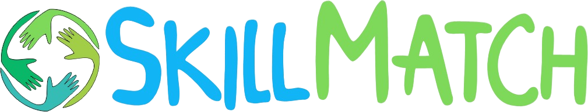

# ⚫ Skill Math  🚀 💚

Skill Match es una innovadora plataforma que permite a las personas intercambiar servicios basados en sus habilidades, eliminando la necesidad de transacciones monetarias. En lugar de dinero, utilizamos un sistema de créditos donde cada servicio prestado o recibido se traduce en créditos. Estos créditos pueden ser utilizados para obtener otros servicios dentro de la plataforma, fomentando un intercambio justo y eficiente de habilidades y recursos.

## ⚫ Tecnologias Utilizadas 🛠️

- [Bubble](https://bubble.io/): La plataforma principal para el desarrollo de la web sin necesidad de código. Bubble permite crear aplicaciones web completas con una interfaz visual, facilitando la creación y gestión de las funcionalidades de Skill Match.

- [Figma](https://www.figma.com/): Herramienta de diseño utilizada para crear y prototipar la interfaz de usuario de Skill Match. Figma permite colaborar en tiempo real y asegurarse de que el diseño sea atractivo y funcional.

## ⚫ Características 📌

Skill Match incluye las siguientes funcionalidades:

- **Registro de usuarios**
  - Los usuarios pueden crear una cuenta en la plataforma.
- **Perfil de usuario**
  - Cada usuario tiene un perfil donde puede mostrar sus habilidades y servicios ofrecidos.
- **Sistema de crédito**
  - Los usuarios ganan créditos al ofrecer servicios y pueden utilizarlos para solicitar servicios de otros.
- **Intercambio de servicios**
  - Los usuarios pueden intercambiar servicios utilizando un sistema de créditos.
- **Chat**
  - Los usuarios pueden comunicarse entre sí a través de un sistema de mensajería en tiempo real.
- **Sistema de valoración y comentarios**
  - Los usuarios pueden dejar valoraciones y comentarios sobre los servicios recibidos.
- **Búsqueda y filtrado**
  - Los usuarios pueden buscar y filtrar servicios basados en diferentes criterios.

## ⚫ Estado del Proyecto ⚙️

Skill Match está actualmente en desarrollo. El estado de las funcionalidades es el siguiente:

- [x] Registro de usuarios
- [x] Perfil de usuario
- [ ] Sistema de crédito
- [x] Crear un servicio
- [ ] Intercambio de servicios
- [ ] Chat
- [ ] Sistema de valoración y comentarios
- [ ] Búsqueda y filtrado

## ⚫ Próximas Etapas 🔧
- Implementar la creación y gestión del perfil de usuario.
- Configurar el sistema de crédito.
- Permitir a los usuarios crear y listar nuevos servicios.
- Implementar el sistema de intercambio de servicios basado en créditos.
- Integrar un sistema de chat en tiempo real para la comunicación entre usuarios.
- Desarrollar el sistema de valoración y comentarios.
- Añadir funcionalidades de búsqueda y filtrado de servicios.

El proyecto está en una fase temprana de desarrollo, con varias características clave en progreso. Las próximas etapas se centrarán en completar la funcionalidad principal y mejorar la experiencia del usuario.

## ⚫ Instalación y Configuración ⚛️

Sigue estos pasos para configurar tu entorno de desarrollo y empezar a trabajar con Skill Match:

1. **Regístrate en Bubble.io**
   - Ve a [Bubble.io](https://bubble.io) y crea una cuenta si no tienes una.
   
2. **Descarga los archivos de este repositorio**

3. **Importa el proyecto en tu cuenta de Bubble.io**
   - Inicia sesión en tu cuenta de Bubble.io.
   - Crea una nueva aplicación y selecciona la opción para importar un proyecto existente.
   - Sube los archivos del proyecto que has descargado.

4. **Configura las variables de entorno y cualquier otra configuración necesaria**
   - Asegúrate de configurar cualquier variable de entorno necesaria para tu aplicación. Esto puede incluir claves API, configuraciones de base de datos u otros parámetros específicos del entorno.
   - Consulta la documentación de Bubble.io para obtener detalles sobre cómo configurar variables de entorno y otros ajustes de la aplicación.

5. **Revisa y ajusta la configuración del proyecto en Bubble.io**
   - Ve a la sección de "Settings" de tu aplicación en Bubble.io y ajusta las configuraciones según sea necesario. Esto puede incluir la configuración de permisos, dominios personalizados, y otras opciones relevantes para tu proyecto.

6. **Lanza tu aplicación**
   - Una vez que hayas configurado todo, puedes lanzar tu aplicación desde el panel de control de Bubble.io. Asegúrate de probar todas las funcionalidades para verificar que todo funciona correctamente.

Si encuentras algún problema durante la instalación y configuración, no dudes en abrir un issue en este repositorio o consultar la [documentación de Bubble](https://manual.bubble.io/).

## ⚫ Imagenes 📸

| Registro e inicio de sesion |  |
| ---      | ---       |
| Pantalla de carga |          |
| Menu de Inicio     |         |
| Buscador     |  |
| Mi Perfil |          |

## ⚫ Autores 👇 

| Nombre | Github | Linkedln |
| :---         |     :---:      |          ---: |
| Yadira Avila   | [Perfil](https://github.com/Yadavil) | [Perfil](https://www.linkedin.com/in/yadiraavilauxui/) |
| Yeison Arias     | [Perfil](https://github.com/FrostARIAS) | [Perfil](https://www.linkedin.com/in/yeison-arias-263b972a6/) |
| Maria Arismendi     | [Perfil](https://github.com/mariA290192) | [Perfil](https://github.com/mariA29019)      |

