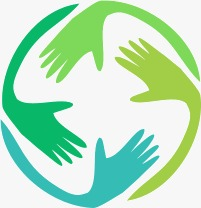
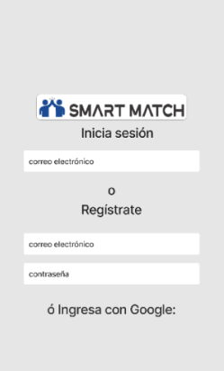
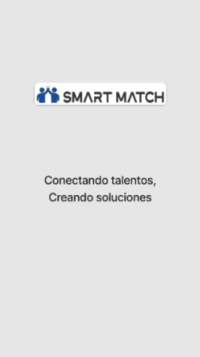
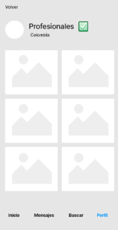
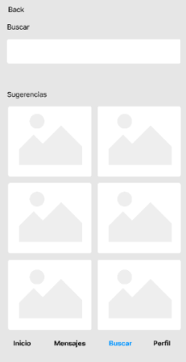

# Skill Math

Skill Macth es una plataforma donde las personas pueden intercambiar servicios en función de sus habilidades sin necesidad de dinero siendo reemplazado por un sistema de créditos donde cada servicio prestado o recibido se traduciría en créditos que podrían ser utilizados para obtener otros servicios dentro de la plataforma.

## Proceso

SkillMatch se encuentra en una fase beta desarollandose con [Bublleo.io](https://bubble.io/) y [Figma](https://www.figma.com/)

## Caracteristiccas

Algunas de las caracteristicas a destacar son
- Facilita el intercambio de habilidades y servicios entre profesionales de diferentes campos.
- Promueve una economía colaborativa y sin necesidad de dinero.
- Fomenta el trabajo conjunto y la cooperación entre individuos con diferentes habilidades
- Fomenta un sentido de pertenencia y colaboración

## Prototipos

| Registro e inicio de sesion |  |
| ---      | ---       |
| Pantalla de carga |          |
| Menu de Inicio     |         |
| Buscador     |  |
| Mi Perfil |          |

## Autores

- [Yadira Avila](https://github.com/Yadavil)
- [Yeison Arias](https://github.com/FrostARIAS)
- [Maria Arismendi](https://github.com/mariA290192)
